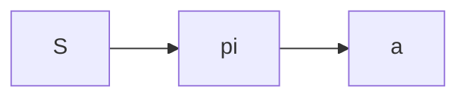

我们已经知道，PPO是在AC架构的基础上进行扩展的经典之作。比较关键的技巧是GAE+TD。为了自己的复习考量，这篇文章还是参考[《深入浅出强化学习》](https://link.jscdn.cn/1drv/aHR0cHM6Ly8xZHJ2Lm1zL2IvcyFBa3A3T0FGTWxmRUtoZTh6bno2bEVLSEk3WG9CN3c_ZT1QTDFWOHM.pdf)，从比较前面开始讲起。希望能够真正理解这些知识，而不仅仅是浮于表面。

### 基于模型的强化学习

我们知道，马尔科夫决策过程(MDP)，可以利用元组$(S, A, P, r, \gamma)$ 基于模型的强化学习意即，存在这样的一个模型，告诉我们所有的状态的状态转移概率和回报，那么根据贝尔曼最优性原理，可以得到贝尔曼最优化方程：

$$
\begin{aligned}
&v^*(s)=\max _a R_s^a+\gamma \sum_{s ' \in S} P_{s s^{\prime}}^a v^*\left(s^{\prime}\right) \\
&q^*(s, a)=R_s^a+\gamma \sum_{s^{\prime} \in S} P_{s s^{\prime}}^a \max _{a^{\prime}} q^*\left(s^{\prime}, a^{\prime}\right)
\end{aligned}
$$

注意，这里状态价值函数$v$和行为状态价值函数$q$，实际上是一个先验的随机分布，所以对于不同的状态或者状态行为的输入都有值。由于基于模型，知道所有的状态和行为，所以就有状态转移方程，实际上就可以根据贝尔曼方程对$v$，$q$做更新直到其收敛。整体的思路就是动态规划的想法。

给定状态，基于状态生成动作，称之为策略，实际上策略也是强化学习最终应用在实际的结果。

基于策略，实际上可以改为

$$
v_\pi(s)=\sum_{a \in A} \pi(a \mid s) q_\pi(s, a)
$$

$$
v_\pi(s)=\sum_{a \in A} \pi(a \mid s)\left(R_s^a+\gamma \sum_{s^{\prime} \in S} P_{s s^{\prime}}^a v_\pi\left(s^{\prime}\right)\right)
$$

在策略评估中，策略$\pi$保持不变，直到$v$，$q$收敛。然后根据$v$， $q$的情况重新改善策略$\pi$。有时候未必需要等到策略评估算法完全收敛，在评估一次后就进行策略改善，这就是值函数迭代算法。值函数迭代算法是动态规划算法最一般的计算框架。

### 基于值函数的强化学习方法

+ 有模型的情况下，可以根据如下方程去计算值函数：
$$
v_\pi(s)=\sum_{a \in A} \pi(a \mid s)\left(R_s^a+\gamma \sum_{s^{\prime} \in S} P_{s s^{\prime}}^a v_\pi\left(s^{\prime}\right)\right)
$$
但是在无模型的情况下，状态转移概率$P_{ss^{'}}^a$是未知的。或者说，状态空间很大，状态转移概率也并不能简单地计算出来。甚至是PMODP，也就是部分可观测的情况下，无法建模。想要使用上述框架，就必须使用别的方法去估计值函数$q$，$v$。

+ 同策略和异策略
同策略(on-policy)是指产生数据的策略与评估和要改善的策略是同一个策略。异策略(off-policy)是指产生数据的策略与评估改善的策略并不是同一个策略，通常用$\mu$表示样本生成的策略，而$\pi$表示用来评估和改善的策略。因此PPO是一种on-policy的算法。

#### 基于蒙特卡洛的强化学习方法

蒙特卡洛是对马尔可夫链采样，从而估计值函数的方法。

1. 蒙特卡洛方法
    蒙特卡洛方法使用随机样本对值函数进行估计。值函数最初的定义：
    $$
    v_\pi(s)=E_\pi\left[G_t \mid S_t=s\right]=E_\pi\left[\sum_{k=0}^{\infty} \gamma^k R_{t+k+1} \mid S_t=s\right]
    $$
    $$
    q_\pi(s)=E_\pi\left[\sum_{k=0}^{\infty} \gamma^k R_{t+k+1} \mid S_t=s, A_t=a\right]
    $$

2. 采样
    现在我们已经有了一个待改善的未收敛的策略，我们需要根据这个策略来产生样本。比如输入$s_0$，我们就能够得到一个

    重要性采样也是因为异策略下，由于样本生成的策略并不是实际的策略，因此需要对产生的回报进行加权。根据提议分布产生样本数据的，还有接受-拒绝采样。但因为有时候目标分布非常的复杂，很难构建提议分布；有时候对于多维数据，我们只能拿到边缘分布，因此也很难做这件事。
    接受率并不一定非要使用提议分布和目标分布产生，相反我们可以直接基于生成的马尔可夫链进行采样，也就是MCMC采样，参见刘建平的[MCMC系列博客](https://www.cnblogs.com/pinard/p/6625739.html)。MCMC背后的定理是马氏链平稳分布，参见[马尔可夫链状态划分依据什么?](https://www.zhihu.com/question/402110182/answer/1500480595)，如图：

    

    在前述中，我们并没有给策略一个定义，而这里依照我的理解，我们可以安全地说，对于某一状态$S$，$\pi (A|S)$的该状态下动作的分布。而对于所有这样的状$S$，都会有这样的分布。所以$\pi$实际上是动作状态的二维矩阵。$P(S_{k+1}| S_k, A_k)$是在状态$S_k$下采取动作$A_K$后得到状态$S_{k+1}$的概率。在定理中，我们假设动作已经给定，在这样的动作下，$\pi$给出的就是一个概率。这里的$\pi$有个很重要的性质，对于输入的给定状态，产生的动作的概率和为1， 对于不同的输入状态，

#### 时间差分(TD error)

### 策略梯度
