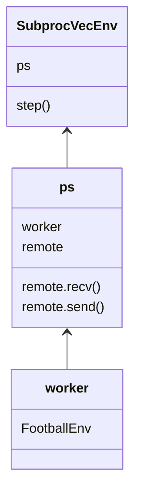

之前研读过light-mappo的代码，对于其中强化学习的部分已经有所了解，想要自己跑一下但是环境的部分被抽走了，所以还是看看原版的代码并做点笔记。

先介绍一下MAPPO，原文[The Surprising Effectiveness of PPO in Cooperative, Multi-Agent Games](https://arxiv.org/abs/2103.01955)，主要解决的问题是，将PPO算法应用在Multi-Agent环境中需要使用的一些技巧，从IPPO扩展到MAPPO。项目地址：[MAPPO](https://github.com/marlbenchmark/on-policy)。

### MAPPO的环境配置

这个项目的第一个难点就是环境配置。项目提供了requirements.txt，使用 ``pip install -r requirements.txt``安装对应的环境。也提供了environment.yaml,  使用 ``conda env create -f environment.yaml`` 命令安装对于的环境。但是由于本项目使用的python 3.6不再维护，很多包的版本也已经过期，所以使用上述命令并不能使得项目能够运行。使用 ``conda create -n py37 python=3.7``命令创建环境。然后建议使用 ``pip install -r requirements.txt``。使用 ``pip freeze > requirements.txt``命令生成。我使用的是[requirements.txt](https://link.jscdn.cn/1drv/aHR0cHM6Ly8xZHJ2Lm1zL3QvcyFBa3A3T0FGTWxmRUtodkpTY3BsYjJfMVFkZzZkYnc_ZT1FZDduckM.txt), 由于使用的CUDA环境不一样，pytorch请自行安装

项目使用了wandb作为训练logger，关于wandb的使用参见，[wandb使用教程(一)：基础用法](https://zhuanlan.zhihu.com/p/493093033)。

在scripts文件夹中给出了很多运行的脚本，但是sh脚本对我来说始终有编码的问题，而python本身就是脚本语言，所以我直接在py文件中添加参数，当然也可以使用命令行运行，我觉得要比sh脚本方便很多。

我选择了足球作为应用的环境，本项目使用了谷歌足球的环境，参见[gfootball](https://github.com/google-research/football/blob/master/README.md), 按照说明按照对应的依赖与环境。将train_football.py放到根目录，然后按照sh文件修改对应的参数，使用wandb需要将对应的用户名改成自己的用户名。

至此应该是能够顺利运行本项目了。下图是我的训练结果，好像不太行。

### 多线程Env

能够运行之后，在train_football.py中的第一步是创建Env。

```python
def make_train_env(all_args):
    def get_env_fn(rank):
        def init_env():
            if all_args.env_name == "Football":
                env = FootballEnv(all_args)
            else:
                print("Can not support the " +
                      all_args.env_name + " environment.")
                raise NotImplementedError
            env.seed(all_args.seed + rank * 1000)
            return env
        return init_env
    if all_args.n_rollout_threads == 1:
        return DummyVecEnv([get_env_fn(0)])
    else:
        return SubprocVecEnv([get_env_fn(i) for i in range(
            all_args.n_rollout_threads)])


def make_eval_env(all_args):
    def get_env_fn(rank):
        def init_env():
            if all_args.env_name == "Football":
                env = FootballEnv(all_args)
            else:
                print("Can not support the " +
                      all_args.env_name + " environment.")
                raise NotImplementedError
            env.seed(all_args.seed * 50000 + rank * 10000)
            return env
        return init_env
    if all_args.n_eval_rollout_threads == 1:
        return DummyVecEnv([get_env_fn(0)])
    else:
        return SubprocVecEnv([get_env_fn(i) for i in range(
            all_args.n_eval_rollout_threads)])

# env init
envs = make_train_env(all_args)
eval_envs = make_eval_env(all_args) if all_args.use_eval else None
num_agents = all_args.num_agents
```

为了实现多线程执行，并且统一收取不同运行环境中的数据，使用SubprocVecEnv创建多线程运行环境。 这里传入SubprocvecEnv的参数env_fns是一个函数，这个函数的返回值是一个环境，这个环境的初始化函数是init_env。

```python
class SubprocVecEnv(ShareVecEnv):
    def __init__(self, env_fns, spaces=None):
        """
        envs: list of gym environments to run in subprocesses
        """
        self.waiting = False
        self.closed = False
        nenvs = len(env_fns)
        self.remotes, self.work_remotes = zip(*[Pipe() for _ in range(nenvs)])
        self.ps = [Process(target=worker, args=(work_remote, remote, CloudpickleWrapper(env_fn)))
                   for (work_remote, remote, env_fn) in zip(self.work_remotes, self.remotes, env_fns)]
        for p in self.ps:
            p.daemon = True  # if the main process crashes, we should not cause things to hang 
            p.start()
        for remote in self.work_remotes:
            remote.close()

        self.remotes[0].send(('get_spaces', None))
        observation_space, share_observation_space, action_space = self.remotes[0].recv()
        ShareVecEnv.__init__(self, len(env_fns), observation_space,
                             share_observation_space, action_space)
```

首先是创建每个进程的通信管道，``multiprocessing.Pipe()``提供了一个管道，可以用来进行进程间的通信。然后将通信进程绑定到worker当中，创建不同的进程。

```python
def worker(remote, parent_remote, env_fn_wrapper):
    # 指示当前进程将不会再往队列中放入对象。双工的通信管道当成单工使用
    parent_remote.close()
    env = env_fn_wrapper.x()
    while True:
        cmd, data = remote.recv()
        if cmd == 'step':
            ob, reward, done, info = env.step(data)
            if 'bool' in done.__class__.__name__:
                if done:
                    ob = env.reset()
            else:
                if np.all(done):
                    ob = env.reset()

            remote.send((ob, reward, done, info))
        elif cmd == 'reset':
            ob = env.reset()
            remote.send((ob))
        elif cmd == 'render':
            if data == "rgb_array":
                fr = env.render(mode=data)
                remote.send(fr)
            elif data == "human":
                env.render(mode=data)
        elif cmd == 'reset_task':
            ob = env.reset_task()
            remote.send(ob)
        elif cmd == 'close':
            env.close()
            remote.close()
            break
        elif cmd == 'get_spaces':
            remote.send((env.observation_space, env.share_observation_space, env.action_space))
        else:
            raise NotImplementedError
```

然后在每个worker进程中，使用env_fn_wrapper.x()来创建环境，然后使用remote.recv()来接收命令，然后使用``remote.send()``来发送数据。在worker中的worker_remote相应地发送进程数据。其中这里足球环境返回的数据是ob, reward, done, info。

通过这种方式，实现了多进程环境的创建、初始化与通信。然后使用``step()``方法收取不同进程产生的训练数据。

```python
class SubprocVecEnv(ShareVecEnv):
    def step_async(self, actions):
        for remote, action in zip(self.remotes, actions):
            remote.send(('step', action))
        self.waiting = True

    def step_wait(self):
        results = [remote.recv() for remote in self.remotes]
        self.waiting = False
        obs, rews, dones, infos = zip(*results)
        return np.stack(obs), np.stack(rews), np.stack(dones), infos

    def step(self, actions):
        """
        Step the environments synchronously.

        This is available for backwards compatibility.
        """
        self.step_async(actions)
        return self.step_wait()
```

关于多线程Env的总结，从流程上，对google football这个环境进行了三层封装，一层是将football封装成FootballEnv，在这之中可以配置reward，以及render方法，第二层是把这个环境塞进worker并且配置通信进程，第三层是将多线程worker封装成一个新的SubprocVecEnv，并且统一进行step, reset, close等操作。


