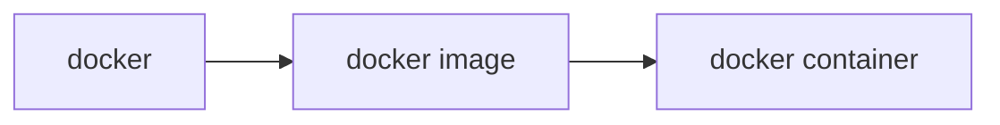

看[《Kubernates in Action》](https://link.jscdn.cn/1drv/aHR0cHM6Ly8xZHJ2Lm1zL2IvcyFBa3A3T0FGTWxmRUtoNWRVS1ZUaWhIMjZsVGxUTXc_ZT03VWlzemw.pdf)做一点笔记。

[minikube文档](https://minikube.sigs.k8s.io/docs/)
[基于minikube的kubernetes官方教程](https://kubernetes.io/zh-cn/docs/tutorials/kubernetes-basics/)

### 容器

容器技术是一种轻量级的虚拟化技术，在Linux架构中，可以通过命名空间跟用户组构建一个与主机相互隔离，占用指定计算资源的进程。在容器中一般可以不受影响地运行应用程序。


### Kubernates 集群架构

k8s简单来说就是对容器进行统一管理跟调度的软件工具。从架构上分为两部分：


### k8s对容器的管理

1. 根据应用的描述信息将对应数量的容器或者容器集合
3. k8s可以根据负载自动决定一个应用程序的最佳副本数量，自动调整副本数。
1. （pod）调度到工作节点上，工作节点上的Kubelets将告知Docker从镜像仓库中拉取容器镜像并且运行容器。
2. k8s会不断地确认应用程序的部署状态始终与描述相匹配。如果其中一个进程崩溃，k8s会自动重新部署该进程。如果整个工作节点都死亡或者无法访问，则k8s会在新节点上部署故障节点中运行的所有容器并且运行。
4. kube-proxy可以为相同的服务配置一个静态ip地址，这样不管容器如何移动或者增减，都可以通过该ip地址访问该服务。还可以确保服务的链接可以跨提供服务的容器实现负载均衡。

### docker基础命令

docker使用主要三部分：



其中container是最后运行的容器实例，而image是容器本身的镜像文件，通过镜像可以build容器实例。docker本身则是对镜像和容器进行管理。以下是一些命令：

+ 构建容器镜像：``docker build -t IMAGE DOCKERFILEPATH``，使用DOCKERFILEPATH下的dockerfile文件构建名叫kubia的镜像。
+ 显示镜像列表：``docker images``。
+ 删除某一镜像：``docker rmi IMAGE``。
+ 运行容器镜像并绑定端口：``docker run --name CONTAINER -p PORT:PORT -d IMAGE``。
+ 获取容器信息：``docker ps``，``docker inspect CONTAINER``会有更详细的信息。
+ 运行容器shell：``docker exec -it kubia-container bash``，前提是镜像本身包含了bash shell，``-i``保证标准输入流开放，``-t``分配一个伪终端，两个选项在一起才能正常运行bash。
+ 开启/重启容器：``docker start CONTAINER``/``docker restart CONTAINER``。
+ 停止容器：``docker stop CONTAINER``。
+ 删除容器: ``docker rm CONTAINER``。
  
+ 为镜像添加标签：``docker tag IMAGE NEWTAG``，标签即为镜像的别名。
+ 推送镜像到docker hub：``docker push TAG``。

### 安装Minikube

minikube是用于构建本地单节点集群的工具，主要用于测试k8s和本地开发应用。配置多节点或者云平台生产环境需要使用更多的k8s集群需要参考[https://kubernetes.io/](https://kubernetes.io/)。

最新版本的minikube集成了kvm/virtualbox的底座，所以不需要额外安装vm。

下载并安装最新版本的minikube：

```bash
curl -LO https://storage.googleapis.com/minikube/releases/latest/minikube-linux-amd64 && chmod +x minikube
sudo mkdir -p /usr/local/bin/ 
sudo install minikube /usr/local/bin/
```

然后运行``minikube start --kubernetes-version=1.23.8``，最新版本的kubernetes会报错，所以这里最好指定kubernetes的镜像版本。如果提示docker版本过低请自行重装一下最新版本的docker。 运行成功会出现：

```shell
* Done! kubectl is now configured to use "minikube" cluster and "default" namespace by d
```

要与kubernetes进行交互，还需要kubectl，注意需要安装对应版本的kubectl，否则会出现兼容性问题。

```bash
curl -LO https://dl.k8s.io/release/v1.23.8/bin/linux/amd64/kubectl
sudo install -o root -g root -m 0755 kubectl /usr/local/bin/kubectl
```

然后运行``kubectl version``，会出现client与server的版本信息。

```shell
Client Version: version.Info{Major:"1", Minor:"23", GitVersion:"v1.23.8", GitCommit:"a12b886b1da059e0190c54d09c5eab5219dd7acf", GitTreeState:"clean", BuildDate:"2022-06-16T05:57:43Z", GoVersion:"go1.17.11", Compiler:"gc", Platform:"linux/amd64"}
Server Version: version.Info{Major:"1", Minor:"23", GitVersion:"v1.23.8", GitCommit:"a12b886b1da059e0190c54d09c5eab5219dd7acf", GitTreeState:"clean", BuildDate:"2022-06-16T05:51:36Z", GoVersion:"go1.17.11", Compiler:"gc", Platform:"linux/amd64"}
```

运行``kubectl cluster-info``查看集群信息。

```shell
Kubernetes control plane is running at https://192.168.49.2:8443
CoreDNS is running at https://192.168.49.2:8443/api/v1/namespaces/kube-system/services/kube-dns:dns/proxy
```
